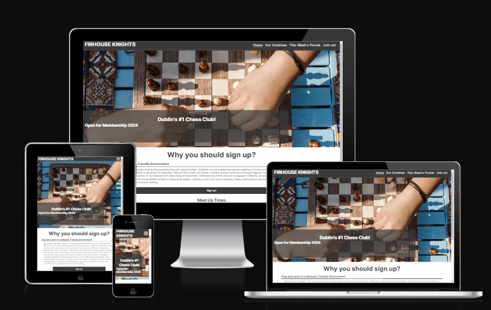

# The Firhouse Knights

This is a website that aims to encourage users to join a local chess club.. 

The website includes a puzzle page, a "meet the team" info page, a signup page with a form, and an engaging homepage with calls to action.

The live link can be found here - [Firhouse Knights](https://fergalmulvey.github.io/firhouse-knights/index.html)

## Site Owner Goals 
- To provide the user with information about the benefits of chess, with a particular focus on joining the club. 
- To provide the user with clear and concise instructions as to how to become a member.
- To present the user with a website that is easy to navigate, fully responsive and invokes a sense of calm through the use of appropriate colours and imagery. 

## Features
- ### Navigation

    - The fully responsive navigation bar includes links to the Logo, Home, About, Poses, Practice and Contribute sections of the same page.
    - The navigation bar has a fixed position so that it remains visible at the top of the page as the user navigates through the individual sections. 
    - This section allows the user to easily navigate through the site to find content without having to scroll back up to the top of the page or use the browser back button.

- ### The Landing Page Image
    - The landing page includes an eye-catching image with a text overlay describing the site's goal.
    - This section provides the user with a clear visual representation of the purpose of the site.

- ### Meet the Team Section
    - The About Section gives a brief description of each of the committee members and further details about what they offer to users.
    - Contact info for all members.

- ### Signup Section
    - Easy to fill out form with all inputs of the correct type.
    - Placeholder text for all text inputs.

- ### Puzzle Section
    - Weekly puzzle uploaded to the site to encourage engagement.
    - Solutions to the previous week's puzzle.

- ### Footer
    - The footer section includes links to The Firhouse Knights's Facebook, Instagram, Twitter and Youtube pages.
    - The links will open to a new tab to allow easy navigation for the user. 
    - The footer is valuable to the user as it allows them to find and follow the Knights on social media

## Technologies Used

### Languages
- HTML5
- CSS

### Frameworks - Libraries - Programs Used
- [Am I Responsive](http://ami.responsivedesign.is/) - Used to verify responsiveness of website on different devices.
- [Responsinator](http://www.responsinator.com/) - Used to verify responsiveness of website on different devices.
- [Balsamiq](https://balsamiq.com/) - Used to generate Wireframe images.
- [Chrome Dev Tools](https://developer.chrome.com/docs/devtools/) - Used for overall development and tweaking, including testing responsiveness and performance.
- [Font Awesome](https://fontawesome.com/) - Used for Social Media icons in footer.
- [GitHub](https://github.com/) - Used for version control and hosting.
- [Google Fonts](https://fonts.google.com/) - Used to import and alter fonts on the page.
- [TinyPNG](https://tinypng.com/) - Used to compress images to reduce file size without a reduction in quality.
- [W3C](https://www.w3.org/) - Used for HTML & CSS Validation.

## Deployment

The project was deployed using GitHub pages. The steps to deploy using GitHub pages are:

1. Go to the repository on GitHub.com
2. Select 'Settings' near the top of the page.
3. Select 'Pages' from the menu bar on the left of the page.
4. Under 'Source' select the 'Branch' dropdown menu and select the main branch.
5. Once selected, click the 'Save'.
6. Deployment should be confirmed by a message on a green background saying "Your site is published at" followed by the web address.

## Credits

### Resources Used

- Inspiration for dropdown nav bar - Love Running Walkthrough Project
- Inspiration for meet the team page - W3 schools
- [Stack Overflow](https://stackoverflow.com/)

## Acknowledgments
My mentor Antonio for his support and advice.

The Code Institute slack community for their quick responses and very helpful feedback!

# sorry for the rushed readme I'm a bit stuck for time!